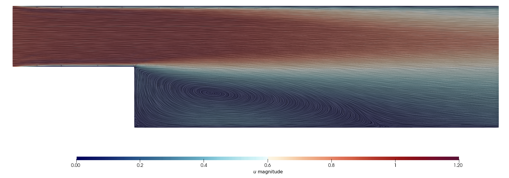

.. Contains the eleventh tutorial.
.. _tutorial_11:

Tutorial 11 - Solving the k-epsilon RANS Turbulence Model (2D)
================================================================

The files for this tutorial can be found in "examples/backward_facing_step".

Governing Equations
--------------------

This tutorial demonstrates OpenCMP's high-Reynolds-number k-epsilon RANS turbulence model. The mean-flow momentum equation gains a turbulent (eddy) viscosity :math:`\nu_t` on top of the molecular kinematic viscosity :math:`\nu`, and two transport equations close the model -- turbulent kinetic energy :math:`k` and its dissipation rate :math:`\epsilon`:

.. math::
   \frac{\partial \bm{u}}{\partial t} + \bm{\nabla} \cdot \left( \bm{u} \bm{w} \right) - \bm{\nabla} \cdot \left[ \left( \nu + \nu_t \right) \bm{\nabla} \bm{u} \right] + \bm{\nabla} p &= \bm{f} \mbox{ in } \Omega \\
   \bm{\nabla} \cdot \bm{u} &= 0 \mbox{ in } \Omega \\
   \frac{\partial k}{\partial t} + \bm{\nabla} \cdot \left( \bm{u} k \right) - \bm{\nabla} \cdot \left[ \left( \nu + \frac{\nu_t}{\sigma_k} \right) \bm{\nabla} k \right] &= P_k - \epsilon \\
   \frac{\partial \epsilon}{\partial t} + \bm{\nabla} \cdot \left( \bm{u} \epsilon \right) - \bm{\nabla} \cdot \left[ \left( \nu + \frac{\nu_t}{\sigma_\epsilon} \right) \bm{\nabla} \epsilon \right] &= C_1 \frac{\epsilon}{k} P_k - C_2 \frac{\epsilon^2}{k}

with production :math:`P_k = 2 \nu_t \, \bm{S} : \bm{S}`, :math:`\bm{S} = \frac{1}{2} \left( \bm{\nabla} \bm{u} + \bm{\nabla} \bm{u}^T \right)`, and the algebraic closure :math:`\nu_t = C_\mu k^2 / \epsilon`.

The standard k-epsilon model is only valid in the fully turbulent log layer, so instead of resolving the viscous sublayer with mesh refinement, OpenCMP applies a wall function on the boundary marked ``wall``: near-wall cells get an algebraic wall-law eddy viscosity and dissipation, while velocity keeps its ordinary no-slip condition. Controlled by the ``[OTHER]`` switches ``wall_function`` and ``wall_boundary``.

The example is a 2D backward-facing step: a duct of height :math:`H = 1` that abruptly expands to height :math:`2H`, generated by "backward_facing_step.geo". ``wall`` covers the upstream floor, the step face, and the downstream floor/ceiling; ``inlet`` and ``outlet`` are the two open ends. Kinematic viscosity is 0.00002, inlet velocity is a uniform 1.0 in x.

The Main Configuration Files
------------------------------

"config_IC" runs a Stokes solve for a divergence-free initial guess, saving velocity and pressure to separate ".sol" files (``split_components = True``) so they can be reloaded individually. "config" runs the main k-epsilon solve.

"config" adds the ``k`` and ``epsilon`` finite elements (discontinuous ``L2``, required for the wall-law dissipation) and switches the model to ``KEpsilonINS``::

   [FINITE ELEMENT SPACE]
   elements = u       -> HDiv
              p       -> L2
              k       -> L2
              epsilon -> L2
   interpolant_order = 3

   [SOLVER]
   linearization_method = Oseen
   nonlinear_solver = NoMixing
   nonlinear_tolerance = relative -> 1e-4
                         absolute -> 1e-4
   nonlinear_max_iterations = 200
   relaxation_factors = 0.5, 0.5, 0.3, 0.3

   [OTHER]
   model = KEpsilonINS
   wall_function = True
   wall_boundary = wall
   production_limiter = True
   auto_turbulence_inlet = inlet

Four relaxation factors are given, one per component (:math:`\bm{u}`, :math:`p`, :math:`k`, :math:`\epsilon`); under-relaxing keeps the segregated k-epsilon iteration from diverging while :math:`\nu_t` is still adjusting. ``auto_turbulence_inlet`` is new -- see below.

The Boundary and Initial Condition Configuration Files
-----------------------------------------------------------

Velocity is no-slip on ``wall`` and uniform at ``inlet``, with a "do-nothing" stress condition at ``outlet``. No values are given for :math:`k` or :math:`\epsilon`, only a zero-flux (Neumann) fallback::

   [DIRICHLET]
   u = inlet -> [1.0, 0.0]
       wall  -> [0.0, 0.0]

   [STRESS]
   u = outlet -> [0.0, 0.0]

   [NEUMANN]
   k       = outlet -> 0.0
             wall -> 0.0
   epsilon = outlet -> 0.0
             wall -> 0.0

Similarly, "ic_dir/ic_config" only supplies :math:`\bm{u}` and :math:`p` (reloaded from the Stokes solve); :math:`k` and :math:`\epsilon` are left unset::

   [KEpsilonINS]
   u = all -> output/components_sol/u.sol
   p = all -> output/components_sol/p.sol

Setting ``auto_turbulence_inlet = inlet`` in "config" tells ``KEpsilonINS`` to fill in the missing inlet Dirichlet values (and initial condition, since none were explicitly given) automatically from the prescribed inlet velocity: it computes the bulk velocity through that boundary, then the standard internal-flow estimate

.. math::
   Re = \frac{U_{bulk} D_H}{\nu}, \quad I = 0.16\, Re^{-1/8}, \quad k = \frac{3}{2}(U_{bulk} I)^2, \quad \epsilon = \frac{C_\mu^{3/4} k^{3/2}}{r \, D_H}

where the hydraulic diameter :math:`D_H` and length-scale ratio :math:`r` come from the model configuration file. Any value the user *does* specify explicitly in ``bc_config``/``ic_config`` still takes precedence.

The Model Configuration File
--------------------------------

The k-epsilon closure constants and numerical safeguards are all shown at their default values (omitting them changes nothing). ``turbulence_hydraulic_diameter`` and ``turbulence_length_scale_ratio`` feed the automatic inlet formula above; for this 2D channel the hydraulic diameter is :math:`2H = 2`::

   [PARAMETERS]
   kinematic_viscosity = all -> 0.00002
   c_mu = all -> 0.09
   c_1 = all -> 1.44
   c_2 = all -> 1.92
   sigma_k = all -> 1.0
   sigma_epsilon = all -> 1.3
   kappa = all -> 0.4187
   e_log = all -> 9.793
   k_floor = all -> 1e-8
   epsilon_floor = all -> 1e-6
   max_viscosity_ratio = all -> 200000
   production_limit_coefficient = all -> 10
   max_epsilon_k_ratio = all -> 10
   turbulence_hydraulic_diameter = all -> 2.0
   turbulence_length_scale_ratio = all -> 0.07

   [FUNCTIONS]
   source = u       -> [0.0, 0.0]
            k       -> 0.0
            epsilon -> 0.0

Running the Simulation
--------------------------

From "examples/backward_facing_step":

1) Run the Stokes solve: :code:`python3 -m opencmp config_IC`
2) Run the k-epsilon solve: :code:`python3 -m opencmp config`

Since ``transient = False``, this is a steady-state solve driven by Picard (Oseen) iteration rather than time steps. The result shows the expected recirculation bubble just downstream of the step:

